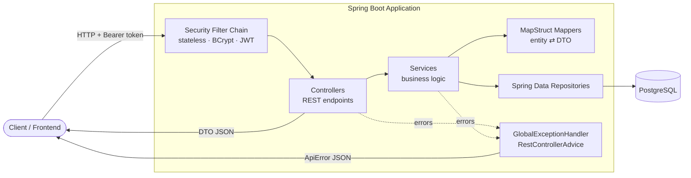
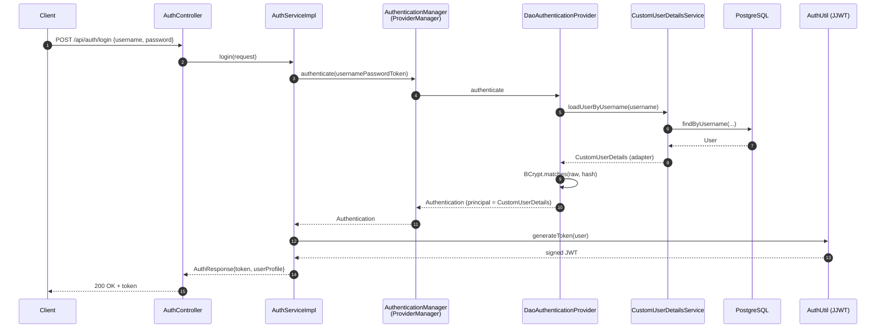
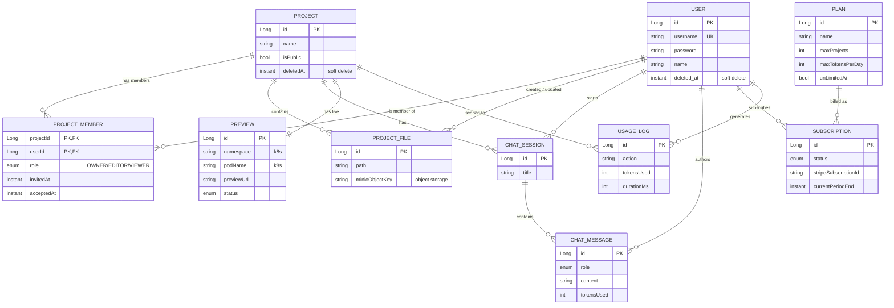
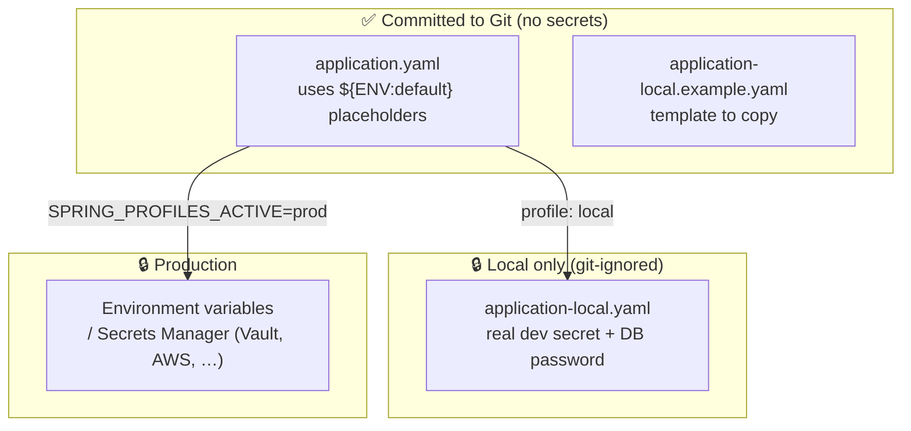

# SaaS AI Editor — Backend

> Backend API for a multi-tenant, AI-powered SaaS code editor — built to demonstrate production-style backend architecture: clean layering, stateless JWT security, an externalized 12-factor configuration model, and a realistic collaboration + billing + AI-usage domain.

<p>
  
  
  
  
  
  
</p>

---

## Table of Contents
- [Overview](#overview)
- [Highlights for Reviewers](#highlights-for-reviewers)
- [Tech Stack](#tech-stack)
- [System Architecture](#system-architecture)
- [System Design & Design Decisions](#system-design--design-decisions)
- [Authentication Deep-Dive](#authentication-deep-dive)
- [Domain Model](#domain-model)
- [API Reference](#api-reference)
- [Configuration & Secrets (12-Factor)](#configuration--secrets-12-factor)
- [Getting Started](#getting-started)
- [Project Structure](#project-structure)
- [Roadmap](#roadmap)

---

## Overview

This service is the backend for a SaaS product where users create coding **projects**, collaborate with **team members**, run AI **chat sessions** against their code, spin up live **previews**, and are billed through **subscription plans** with **usage quotas**.

The codebase is intentionally structured the way a real product team would build it:

```
Controller  →  Service (interface + impl)  →  Repository  →  Database
                     │
                     └──  Mapper (MapStruct)  →  DTO (Java records)
```

Each layer has a single responsibility, DTOs form explicit API contracts, and cross-cutting concerns (security, error handling, configuration) are isolated into dedicated packages.

---

## Highlights for Reviewers

These are the parts of the codebase worth looking at in an interview context:

- **🔐 Stateless JWT authentication** — full signup/login flow on Spring Security 6/7 with `BCrypt`, a custom `UserDetailsService`, and an explicitly-wired `DaoAuthenticationProvider` + `ProviderManager` (no reliance on the auto-built global manager).
- **🧩 Clean adapter over coupling** — the JPA `User` entity is *not* coupled to Spring Security. A `CustomUserDetails` adapter wraps it, keeping the persistence model and the security framework independent.
- **📦 DTO-first API contracts** — every request/response is a Java `record`; entities never leak across the HTTP boundary. MapStruct generates the entity↔DTO mappings at compile time.
- **⚙️ 12-Factor configuration** — config is committed with `${ENV:default}` placeholders; real secrets live only in a git-ignored profile file locally and in environment variables / a secrets manager in production. The app **fails fast** if a required secret is missing.
- **🛡️ Centralized error handling** — a `@RestControllerAdvice` translates domain exceptions into a consistent `ApiError` JSON shape.
- **🗄️ Realistic, indexed domain model** — composite keys (`ProjectMember`), soft deletes, auditing timestamps, and query-tuned indexes on hot paths.

> **Status legend** — ✅ Implemented · 🟡 Partial · ⬜ Scaffolded (contract + wiring exist, business logic pending).

---

## Tech Stack

| Concern | Choice |
|---|---|
| Language | Java 21 |
| Framework | Spring Boot 4.0 (Web, Data JPA, Security) |
| Auth | JJWT 0.13, BCrypt, stateless sessions |
| Persistence | PostgreSQL + Hibernate/JPA |
| Mapping | MapStruct 1.6 |
| Boilerplate | Lombok |
| Build | Maven Wrapper (`./mvnw`) |
| CI | GitHub Actions (`.github/workflows/ci.yml`) |

---

## System Architecture

### Layered design & request flow



### Package responsibilities

| Package | Responsibility |
|---|---|
| `controller` | REST endpoints, request binding, HTTP status mapping |
| `service` / `service.impl` | Business logic behind interfaces (testable, swappable) |
| `repository` | Spring Data JPA repositories + JPQL access filters |
| `mapper` | Compile-time MapStruct entity ⇄ DTO conversions |
| `dto` | Immutable API contracts (`record`s), grouped by domain |
| `entity` | JPA persistence models |
| `enums` | Domain enums (`ProjectRole`, `MessageRole`, …) |
| `security` | JWT, `UserDetails` adapter, `SecurityConfig` |
| `error` | `ApiError`, domain exceptions, global handler |

---

## System Design & Design Decisions

The design follows a **modular monolith**: a single deployable Spring Boot service, internally split into clear layers and domain packages. At this stage (single service, pre-traffic), a monolith keeps iteration fast while the layering leaves a clean seam to extract services later if needed.

Key decisions are recorded below in **decision → reasoning → trade-off** form.

### 1. Layered architecture with interface-driven services
- **Decision:** `Controller → Service (interface + impl) → Repository`, with mappers isolating DTO conversion.
- **Reasoning:** Single responsibility per layer; services are programmed to interfaces so logic is mockable in tests and implementations are swappable.
- **Trade-off:** More files/indirection than putting logic in controllers — accepted for testability and clarity.

### 2. DTO-first contracts using Java records
- **Decision:** Every request/response is an immutable `record`; entities never cross the HTTP boundary.
- **Reasoning:** Decouples the API contract from the persistence schema, prevents accidental leakage of fields (e.g. password hashes), and gives stable, versionable payloads.
- **Trade-off:** Requires mapping code — delegated to **MapStruct** (compile-time, no reflection cost).

### 3. Adapter over the `UserDetails` contract
- **Decision:** `User` stays a plain JPA entity; a `CustomUserDetails` adapter implements `UserDetails`.
- **Reasoning:** Keeps the persistence model free of any Spring Security dependency (separation of concerns / dependency inversion).
- **Trade-off:** One small adapter class instead of making the entity implement the framework interface — a deliberate, clean choice.

### 4. Explicit authentication wiring
- **Decision:** Declare `DaoAuthenticationProvider` + `ProviderManager` beans explicitly instead of consuming the framework's auto-built `AuthenticationManager`.
- **Reasoning:** Explicit, unit-testable wiring; avoids a self-referential `ProviderManager` parent that can cause a `StackOverflowError`.
- **Trade-off:** A few extra lines of config in exchange for predictability and control.

### 5. Stateless, token-based security
- **Decision:** `SessionCreationPolicy.STATELESS`, `BCrypt` password hashing, JWT bearer tokens.
- **Reasoning:** No server-side session state → horizontally scalable; BCrypt is the standard adaptive password hash.
- **Trade-off:** Token revocation is harder than server sessions (mitigated later with short expiry + refresh tokens).

### 6. Role-based ownership via `ProjectMember`
- **Decision:** Model ownership/permissions through a `ProjectMember` join entity (`OWNER`/`EDITOR`/`VIEWER`) with a composite key, rather than an `ownerId` column on `Project`.
- **Reasoning:** Supports true multi-member collaboration and per-user roles from day one.
- **Trade-off:** Slightly more complex queries (composite key, joins) than a single owner column.

### 7. Soft deletes + auditing as conventions
- **Decision:** `deletedAt` for soft deletion and `@CreationTimestamp`/`@UpdateTimestamp` for auditing across core entities; hot query paths are backed by composite indexes.
- **Reasoning:** Preserves history/recoverability and supports auditability; indexes keep "active rows ordered by recency" reads fast.
- **Trade-off:** Queries must consistently filter `deletedAt IS NULL`.

### 8. Centralized error handling
- **Decision:** A `@RestControllerAdvice` (`GlobalExceptionHandler`) maps domain exceptions to a single `ApiError` JSON shape.
- **Reasoning:** Consistent error contract for clients; no try/catch noise in controllers.
- **Trade-off:** Exceptions must be modeled deliberately (`BadRequestException`, `ResourceNotFoundException`).

### 9. Externalized, fail-fast configuration
- **Decision:** Commit config with `${ENV:default}` placeholders; secrets live only in a git-ignored local profile / environment variables; required secrets have **no default**.
- **Reasoning:** 12-factor portability across environments; a misconfigured deploy fails at startup rather than running insecurely.
- **Trade-off:** A one-time local setup step (copy the example file).

### Current limitations (intentionally honest)
- **Endpoints are not yet protected at runtime.** The JWT is *issued* on login, but the **request-side JWT filter** that validates tokens and populates the `SecurityContext` is not wired yet — so authenticated user context is still effectively a placeholder in non-auth controllers. This is the next roadmap item.
- **No persistence-level tenant isolation yet** beyond service/repository access checks.
- **No integration tests** against a real database profile yet (planned via Testcontainers).

### How this scales from here
- Stateless auth ⇒ run **N instances behind a load balancer** with no sticky sessions.
- File storage targets **object storage (MinIO/S3)**, keeping large blobs out of the database.
- Previews are designed around **Kubernetes** (namespace/pod per preview).
- The clean layer boundaries make it straightforward to extract a high-traffic concern (e.g. AI usage) into its own service later.

---

## Authentication Deep-Dive

Authentication is the most complete vertical slice and showcases deliberate Spring Security design choices.

### Design decisions

- **The entity stays decoupled.** `User` is a plain JPA entity. A `CustomUserDetails` **adapter** implements `UserDetails` and wraps the entity, so Spring Security depends only on the `UserDetails` contract — never on the persistence model.
- **Explicit authentication wiring.** Instead of pulling the framework's auto-built `AuthenticationManager`, the app declares its own `DaoAuthenticationProvider` and `ProviderManager`. This is explicit, unit-testable, and avoids a class of self-referential `StackOverflowError` pitfalls.
- **Stateless & hashed.** Sessions are `STATELESS`; passwords are hashed with `BCrypt`; the API is consumed with a `Bearer` JWT.

### Login flow



### Security components

| Component | Role |
|---|---|
| `SecurityConfig` | Filter chain (stateless), `BCryptPasswordEncoder`, `DaoAuthenticationProvider`, `ProviderManager` |
| `CustomUserDetailsService` | Loads a `User` and returns a `CustomUserDetails` |
| `CustomUserDetails` | Adapter exposing only `username`/`password`/authorities to the framework |
| `AuthUtil` | Signs/issues JWTs with a configurable secret + expiry |

---

## Domain Model

The schema models a collaborative SaaS editor with billing and AI-usage tracking. Note that **project ownership is expressed through `ProjectMember` roles** (`OWNER` / `EDITOR` / `VIEWER`) rather than a single owner column — enabling true multi-member collaboration.



**Modeling techniques on show:** composite primary key via `@EmbeddedId` + `@MapsId` (`ProjectMember`), soft deletes (`deletedAt`), automatic auditing (`@CreationTimestamp` / `@UpdateTimestamp`), query-tuned composite indexes on `projects`, and forward-looking integrations (MinIO object storage for files, Kubernetes for previews, Stripe for billing).

---

## API Reference

Base path: `/api`

### Auth
| Method | Endpoint | Status | Description |
|---|---|---|---|
| POST | `/auth/signup` | ✅ | Register a user, hash password, return JWT + profile |
| POST | `/auth/login` | ✅ | Authenticate credentials, return JWT + profile |
| GET | `/auth/me` | ⬜ | Current user's profile |

### Projects
| Method | Endpoint | Status | Description |
|---|---|---|---|
| GET | `/projects` | ✅ | List projects accessible to the user |
| GET | `/projects/{id}` | ✅ | Access-checked project fetch |
| POST | `/projects` | ✅ | Create project (caller becomes `OWNER`) |
| PATCH | `/projects/{id}` | ✅ | Owner-only rename |
| DELETE | `/projects/{id}` | ✅ | Owner-only soft delete |

### Members
| Method | Endpoint | Status | Description |
|---|---|---|---|
| GET | `/projects/{projectId}/members` | ✅ | Owner + invited members |
| POST | `/projects/{projectId}/members` | ✅ | Owner-only invite (validated) |
| PATCH | `/projects/{projectId}/members/{memberId}` | ⬜ | Change member role |
| DELETE | `/projects/{projectId}/members/{memberId}` | ⬜ | Remove member |

### Files · Billing · Usage
| Method | Endpoint | Status | Description |
|---|---|---|---|
| GET | `/projects/{projectId}/files` | ⬜ | File tree |
| GET | `/projects/{projectId}/files/{*path}` | ⬜ | File content |
| GET | `/plans` | ⬜ | Available plans |
| GET | `/me/subscription` | ⬜ | Current subscription |
| POST | `/stripe/checkout` | ⬜ | Create checkout session |
| POST | `/stripe/portal` | ⬜ | Customer portal link |
| GET | `/usage/today` | ⬜ | Today's usage |
| GET | `/usage/limits` | ⬜ | Plan limits |

**Error contract** — handled centrally by `GlobalExceptionHandler`:

| Exception | HTTP | Body |
|---|---|---|
| `BadRequestException` | 400 | `ApiError` |
| `ResourceNotFoundException` | 404 | `ApiError` |
| `MethodArgumentNotValidException` | 400 | `ApiError` (field errors) |

---

## Configuration & Secrets (12-Factor)

Configuration follows the **commit the config, externalize the secrets** principle.



- `application.yaml` is committed and contains **no secrets** — only `${DB_URL:...}`, `${JWT_SECRET_KEY}`, etc.
- `${JWT_SECRET_KEY}` has **no default**, so a misconfigured production deploy **fails fast** instead of running with a weak key.
- Local development uses the `local` profile (default), which loads the git-ignored `application-local.yaml`.
- Production sets `SPRING_PROFILES_ACTIVE=prod` and injects secrets via the environment.

---

## Getting Started

### Prerequisites
- Java 21+
- PostgreSQL running locally (default: `localhost:5432`, database `saas_ai`)

### 1. Provide local config
```bash
cp src/main/resources/application-local.example.yaml \
   src/main/resources/application-local.yaml
# edit application-local.yaml: set your DB password (if any) and a dev JWT secret
```

### 2. Run
```bash
./mvnw spring-boot:run         # starts on the 'local' profile by default
```

### 3. Try it
```bash
# Sign up
curl -X POST http://localhost:8080/api/auth/signup \
  -H "Content-Type: application/json" \
  -d '{"username":"vikki","password":"secret123","name":"Vikki"}'

# Log in
curl -X POST http://localhost:8080/api/auth/login \
  -H "Content-Type: application/json" \
  -d '{"username":"vikki","password":"secret123"}'
```

### Build & test
```bash
./mvnw clean compile
./mvnw test
```

---

## Project Structure

```
src/main/java/com/viki/projects/saas_ai_editor
├── controller/      # REST endpoints
├── service/         # interfaces
│   └── impl/        # business logic
├── repository/      # Spring Data JPA
├── mapper/          # MapStruct
├── dto/             # API contracts (records): auth · project · member · subscription
├── entity/          # JPA models
├── enums/           # domain enums
├── security/        # JWT, UserDetails adapter, SecurityConfig
└── error/           # ApiError + global handler
```

---

## Roadmap

- [ ] JWT authentication **filter** to populate `SecurityContext` and protect `/api/**` (replace remaining placeholder user context)
- [ ] `GET /auth/me` and member role-update / removal logic
- [ ] File service + MinIO object storage integration
- [ ] Stripe billing: checkout, customer portal, subscription sync
- [ ] Usage tracking + quota enforcement against `Plan` limits
- [ ] Live previews via Kubernetes
- [ ] Integration tests on an isolated `test` profile (Testcontainers)

---

<sub>Built as a portfolio project to demonstrate production-style Spring Boot backend engineering.</sub>
